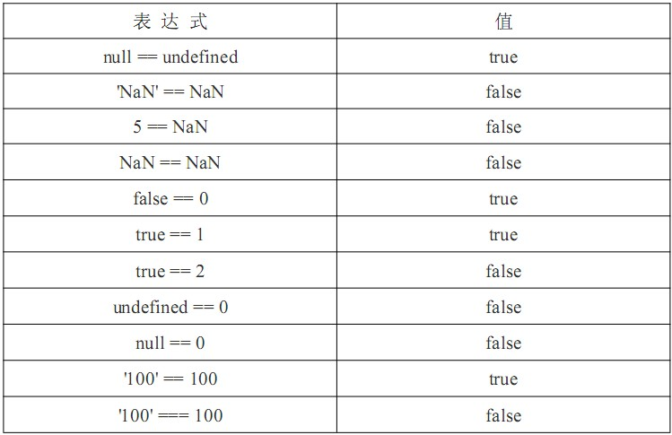
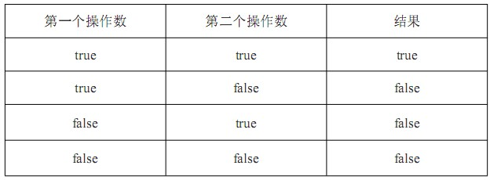
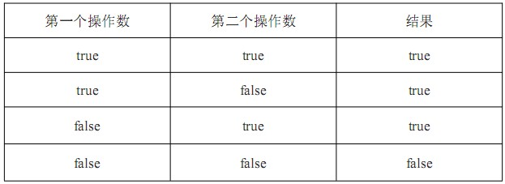
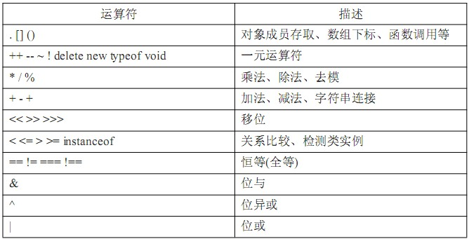

ECMA-262 描述了一组用于操作数据值的运算符，包括一元运算符、布尔运算符、算术运算符、关系运算符、三元运算符、位运算符及赋值运算符。ECMAScript 中的运算符适用于很多值，包括字符串、数值、布尔值、对象等。不过，通过上一章我们也了解到，应用于对象时通常会调用对象的 valueOf()和 toString()方法，以便取得相应的值。
PS： typeof 操作符、new 操作符，也可以称之为 typeof 运算符、new 运算符，是同一个意思。

#### 一．什么是表达式

表达式是 ECMAScript 中的一个“短语”，解释器会通过计算把它转换成一个值。最简单的表达式是字面量或者变量名。例如：

	5.96//数值字面量
	'Lee'//字符串字面量
	true//布尔值字面量
	null//空值字面量
	/Java///正则表达式字面量
	{x:1, y:2}//对象字面量、对象表达式
	[1,2,3]//数组字面量、数组表达式
	function(n) {return x+y;}//函数字面量、函数表达式
	box//变量

当然，还可以通过合并简单的表达式来创建复杂的表达式。比如：

	box + 5.96//加法运算的表达式
	typeof(box)//查看数据类型的表达式
	box > 8//逻辑运算表达式

通过上面的叙述，我们得知，单一的字面量和组合字面量的运算符都可称为表达式。

#### 二．一元运算符

只能操作一个值的运算符叫做一元运算符。

**1.递增++和递减--**

	var box = 100
	++box;;//把 box 累加一个 1，相当于 box = box+1
	--box;//把 box 累减一个 1，相当于 box = box-1
	box++;//同上
	box--;//同上

**2.前置和后置的区别**

在没有赋值操作，前置和后置是一样的。但在赋值操作时，如果递增或递减运算符前置，那么前置的运算符会先累加或累减再赋值，如果是后置运算符则先赋值再累加或累减。

	var box = 100;
	var age = ++box;//age 值为 101
	var height = box++;//height 值为 100

**3.其他类型应用一元运算符的规则**

	var box = '89'; box++;//90，数值字符串自动转换成数值
	var box = 'ab'; box++;//NaN，字符串包含非数值转成 NaN
	var box = false; box++;//1，false 转成数值是 0，累加就是 1
	var box = 2.3; box++;//3.3，直接加 1
	var box = {//1，不设置 toString 或 valueOf 即为 NaN
		toString : function() {
			return 1;
		}
	};box++;

**4.加和减运算符**

加运算规则如下：

	var box = 100; +box;//100，对于数值，不会产生任何影响
	var box = '89'; +box;//89，数值字符串转换成数值
	var box = 'ab'; +box;//NaN，字符串包含非数值转成 NaN
	var box = false; +box;//0，布尔值转换成相应数值
	var box = 2.3; +box;//2.3，没有变化
	var box = {//1，不设置 toString 或 valueOf 即为 NaN
		toString : function() {
			return 1;
		}
	};+box;

减运算规则如下：

	var box = 100; -box;//-100，对于数值，直接变负
	var box = '89'; -box;//-89，数值字符串转换成数值
	var box = 'ab'; -box;//NaN，字符串包含非数值转成 NaN
	var box = false; -box;//0，布尔值转换成相应数值
	var box = 2.3; -box;//-2.3，没有变化
	var box = {//-1，不设置 toString 或 valueOf 即为 NaN
		toString : function() {
			return 1;
		}
	};-box;

加法和减法运算符一般用于算术运算，也可向上面进行类型转换。

#### 三．算术运算符

ECMAScript 定义了 5 个算术运算符，加减乘除求模(取余)。如果在算术运算的值不是数值，那么后台会先使用 Number()转型函数将其转换为数值(隐式转换)。

**1.加法**

	var box = 1 + 2;//等于 3
	var box = 1 + NaN;//NaN，只要有一个 NaN 就为 NaN
	var box = Infinity + Infinity;//Infinity
	var box = -Infinity + -Infinity;//-Infinity
	var box = Infinity + -Infinity;//NaN，正无穷和负无穷相加等 NaN
	var box = 100 + '100';//100100，字符串连接符，有字符串就不是加法
	var box = '您的年龄是：' + 10 + 20;//您的年龄是：1020，被转换成字符串
	var box = 10 + 20 + '是您的年龄';//30 是您的年龄，没有被转成字符串
	var box = '您的年龄是：' + (10 + 20);//您的年龄是：30，没有被转成字符串
	var box = 10 + 对象;//10[object Object]，如果有 toString()或 valueOf()则返回 10+返回数的值

**2.减法**

	var box = 100 - 70;//等于 30
	var box = -100 - 70;//等于-170
	var box = -100 - -70;//-30，一般写成-100 - (-70)比较清晰
	var box = 1 - NaN;//NaN，只要有一个 NaN 就为 NaN
	var box = Infinity - Infinity;//NaN
	var box = -Infinity - -Infinity;//NaN
	var box = Infinity - -Infinity;//Infinity
	var box = -Infinity - Infinity;//-Infinity
	var box = 100 - true;//99，true 转成数值为 1
	var box = 100 - '';//100，''转成了 0
	var box = 100 - '70';//30，'70'转成了数值 70
	var box = 100 - null;//100，null 转成了 0
	var box = 100 - 'Lee';//NaN，Lee 转成了 NaN
	var box = 100 - 对象;//NaN，如果有 toString()或 valueOf()则返回 10-返回数的值

**3.乘法**

	var box = 100 * 70;//7000
	var box = 100 * NaN;//NaN，只要有一个 NaN 即为 NaN
	var box = Infinity * Infinity;//Infinity
	var box = -Infinity * Infinity ;//-Infinity
	var box = -Infinity * -Infinity ;//Infinity
	var box = 100 * true;//100，true 转成数值为 1
	var box = 100 * '';//0，''转成了 0
	var box = 100 * null;//0，null 转成了 0
	var box = 100 * 'Lee';//NaN，Lee 转成了 NaN
	var box = 100 * 对象;//NaN，如果有 toString()或 valueOf()则返回 10 - 返回数的值

**4.除法**

	var box = 100 / 70;//1.42....
	var box = 100 / NaN;//NaN
	var box = Infinity / Infinity;//NaN
	var box = -Infinity / Infinity ;//NaN
	var box = -Infinity / -Infinity;//NaN
	var box = 100 / true;//100，true 转成 1
	var box = 100 / '';//Infinity，
	var box = 100 / null;//Infinity，
	var box = 100 / 'Lee';//NaN
	var box = 100 / 对象;//NaN，如果有 toString()或 valueOf()则返回 10 / 返回数的值

**5.求模**

	var box = 10 % 3;//1，余数为 1
	var box = 100 % NaN;//NaN
	var box = Infinity % Infinity;//NaN
	var box = -Infinity % Infinity ;//NaN
	var box = -Infinity % -Infinity;//NaN
	var box = 100 % true;//0
	var box = 100 % '';//NaN
	var box = 100 % null;//NaN
	var box = 100 % 'Lee';//NaN
	var box = 100 % 对象;//NaN，如果有 toString()或 valueOf()则返回 10 % 返回数的值

#### 四．关系运算符

用于进行比较的运算符称作为关系运算符：小于(<)、大于(>)、小于等于(<=)、大于等于(>=)、相等(==)、不等(!=)、全等(恒等)(===)、不全等(不恒等)(!==)和其他运算符一样，当关系运算符操作非数值时要遵循一下规则：

1.两个操作数都是数值，则数值比较；
2.两个操作数都是字符串，则比较两个字符串对应的字符编码值；
3.两个操作数有一个是数值，则将另一个转换为数值，再进行数值比较；
4.两个操作数有一个是对象，则先调用 valueOf()方法或 toString()方法，再用结果比较；
 
	var box = 3 > 2;//true
	var box = 3 > 22;//false
	var box = '3' > 22;//false
	var box = '3' > '22';//true
	var box = 'a' > 'b';//false a=97,b=98
	var box = 'a' > 'B';//trueB=66
	var box = 1 > 对象;//false，如果有 toString()或 valueOf()则返回 1 > 返回数的值

在相等和不等的比较上，如果操作数是非数值，则遵循一下规则：

1.一个操作数是布尔值，则比较之前将其转换为数值，false 转成 0，true 转成 1；
2.一个操作数是字符串，则比较之前将其转成为数值再比较；
3.一个操作数是对象，则先调用 valueOf()或 toString()方法后再和返回值比较；
4.不需要任何转换的情况下，null 和 undefined 是相等的；
5.一个操作数是 NaN，则==返回 false，!=返回 true；并且 NaN 和自身不等；
6.两个操作数都是对象，则比较他们是否是同一个对象，如果都指向同一个对象，则返回 true，否则返回 false。
7.在全等和全不等的判断上，比如值和类型都相等，才返回 true，否则返回 false。

	var box = 2 == 2;//true
	var box = '2' == 2;//true，'2'会转成成数值 2
	var box = false == 0;//true，false 转成数值就是 0
	var box = 'a' == 'A';//false，转换后的编码不一样
	var box = 2 == {};//false，执行 toString()或 valueOf()会改变
	var box = 2 == NaN;//false，只要有 NaN，都是 false
	var box = {} == {};//false，比较的是他们的地址，每个新创建对象的引用地址都不同
	var age = {};
	var height = age;
	var box = age == height;//true，引用地址一样，所以相等
	var box = '2' === 2;//false，值和类型都必须相等
	var box = 2 !== 2;//false，值和类型都相等了

**特殊值对比表**

#### 五．逻辑运算符

逻辑运算符通常用于布尔值的操作，一般和关系运算符配合使用，有三个逻辑运算符：逻辑与(AND)、逻辑或(OR)、逻辑非(NOT)。

**1.逻辑与(AND) ：&**

	var box = (5 > 4) & (4 > 3)//true，两边都为 true，返回 true

如果两边的操作数有一个操作数不是布尔值的情况下，与运算就不一定返回布尔值，此时，遵循已下规则：

1.第一个操作数是对象，则返回第二个操作数；
2.第二个操作数是对象，则第一个操作数返回 true，才返回第二个操作数，否则返回 false;
3.有一个操作数是 null，则返回 null；
4.有一个操作数是 undefined，则返回 undefined。

	var box = 对象 & (5 > 4);//true，返回第二个操作数
	var box = (5 > 4) & 对象;//[object Object]
	var box = (3 > 4) & 对象;//false
	var box = (5 > 4) & null;//null

逻辑与运算符属于短路操作，顾名思义，如果第一个操作数返回是 false，第二个数不管是 true 还是 false 都返回的 false。

	var box = true & age;//出错，age 未定义
	var box = false & age;//false，不执行 age 了

**2.逻辑或(OR)：||**

	var box = (9 > 7) || (7 > 8);//true，两边只要有一边是 true，返回 true

如果两边的操作数有一个操作数不是布尔值的情况下，逻辑与运算就不一定返回布尔值，此时，遵循已下规则：

1.第一个操作数是对象，则返回第一个操作数；
2.第一个操作数的求值结果为 false，则返回第二个操作数；
3.两个操作数都是对象，则返回第一个操作数；
4.两个操作数都是 null，则返回 null；
5.两个操作数都是 NaN，则返回 NaN；
6.两个操作数都是 undefined，则返回 undefined；

	var box = 对象 || (5 > 3);//[object Object]
	var box = (5 > 3) || 对象;//true
	var box = 对象 1 || 对象 2;//[object Object]
	var box = null || null;//null
	var box = NaN || NaN;//NaN
	var box = undefined || undefined;//undefined

和逻辑与运算符相似，逻辑或运算符也是短路操作。当第一操作数的求值结果为 true，就不会对第二个操作数求值了。

	var box = true || age;//true
	var box = false || age;//出错，age 未定义

我们可以利用逻辑或运算符这一特性来避免为变量赋 null 或 undefined 值。

	var box = oneObject || twoObject;//把其中一个有效变量值赋给 box

**3.逻辑非(NOT)：!**

逻辑非运算符可以用于任何值。无论这个值是什么数据类型，这个运算符都会返回一个布尔值。它的流程是：先将这个值转换成布尔值，然后取反，规则如下：

1.操作数是一个对象，返回 false；
2.操作数是一个空字符串，返回 true；
3.操作数是一个非空字符串，返回 false；
4.操作数是数值 0，返回 true；
5.操作数是任意非 0 数值(包括 Infinity)，false；
6.操作数是 null，返回 true；
7.操作数是 NaN，返回 true；
8.操作数是 undefined，返回 true；

	var box = !(5 > 4);//false
	var box = !{};//false
	var box = !'';//true
	var box = !'Lee';//false
	var box = !0;//true
	var box = !8;//false
	var box = !null;//true
	var box = !NaN;//true
	var box = !undefined;//true

使用一次逻辑非运算符，流程是将值转成布尔值然后取反。而使用两次逻辑非运算符就是将值转成成布尔值取反再取反，相当于对值进行 Boolean()转型函数处理。

	var box = !!0;//false
	var box = !!NaN;//false

通常来说，使用一个逻辑非运算符和两个逻辑非运算符可以得到相应的布尔值，而使用三个以上的逻辑非运算符固然没有错误，但也没有意义。

#### 六．位运算符

位运算符有七种，分别是：位非 NOT(~)、位与 AND(&)、位或 OR（|）、位异或 XOR(^)、左移(<<)、有符号右移(>>)、无符号右移(>>>)。

PS：在一般的应用中，我们基本上用不到位运算符。虽然，它比较基于底层，性能和速度会非常好，而就是因为比较底层，使用的难度也很大。所以，我们作为选学来对待。

	var box = ~25;//-26
	var box = 25 & 3;//1
	var box = 25 | 3;//27
	var box = 25 << 3;//200

	var box = 25 >> 2;//6
	var box = 25 >>> 2;//6

更多的详细：[http://www.w3school.com.cn/js/pro_js_operators_bitwise.asp](http://www.w3school.com.cn/js/pro_js_operators_bitwise.asp)

#### 七．赋值运算符

赋值运算符用等于号(=)表示，就是把右边的值赋给左边的变量。var box = 100;//把 100 赋值给 box 变量复合赋值运算符通过 x=的形式表示，x 表示算术运算符及位运算符。

	var box = 100;
	box = box +100;//200，自己本身再加 100

这种情况可以改写为：

	var box = 100；
	box += 100;
	//200，+=代替 box+100

除了这种+=加/赋运算符，还有其他的几种如下：

1.乘/赋(*=)
2.除/赋(/=)
3.模/赋(%=)
4.加/赋(+=)
5.减/赋(-=)
6.左移/赋(<<=)
7.有符号右移/赋(>>=)
8.无符号有移/赋(>>>=)

#### 八．其他运算符

**1.字符串运算符**

字符串运算符只有一个，即："+"。它的作用是将两个字符串相加。规则：至少一个操作数是字符串即可。

	var box = '100' + '100';//100100
	var box = '100' + 100;//100100
	var box = 100 + 100;//200

**2.逗号运算符**

逗号运算符可以在一条语句中执行多个操作。

	var box = 100, age = 20, height = 178; //多个变量声明
	var box = (1,2,3,4,5);//5，变量声明，将最后一个值赋给变量，不常用
	var box = [1,2,3,4,5];//[1,2,3,4,5]，数组的字面量声明
	var box = {//[object Object]，对象的字面量声明
		1 : 2,

		3 : 4,
		5:6
	};

**3.三元条件运算符**

三元条件运算符其实就是后面将要学到的 if 语句的简写形式。

	var box = 5 > 4 ? '对' : '错';//对，5>4 返回 true 则把'对'赋值给 box，反之。

相当于：

	var box = '';//初始化变量
	if (5 > 4) {//判断表达式返回值
		box = '对';//赋值
	} else {
		box = '错';//赋值
	}

#### 九．运算符优先级

在一般的运算中，我们不必考虑到运算符的优先级，因为我们可以通过圆括号来解决这种问题。比如：

	var box = 5 - 4 * 8;//-27
	var box = (5 - 4) * 8;//8

但如果没有使用圆括号强制优先级，我们必须遵循以下顺序：

**运算符**

