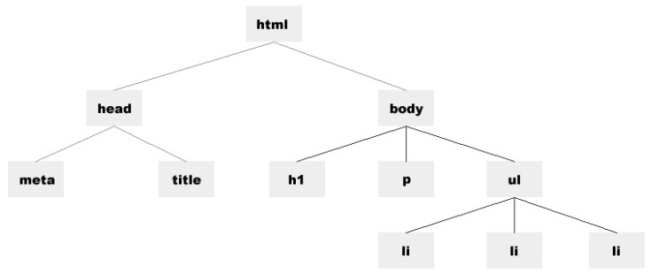
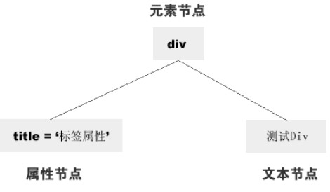
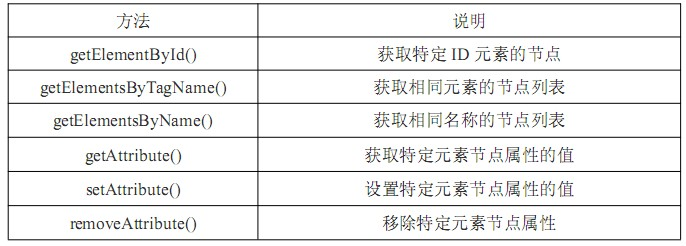
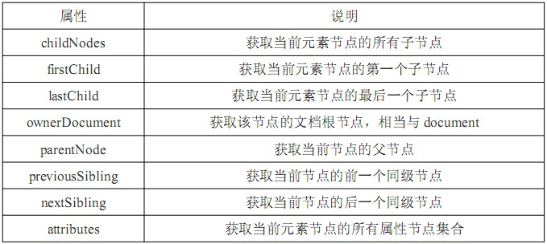
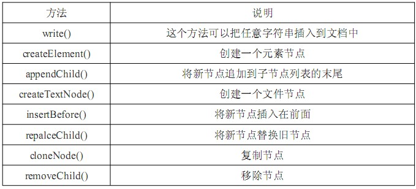

DOM（Document Object Model）即文档对象模型，针对 HTML 和 XML 文档的 API（应用程序接口）。DOM 描绘了一个层次化的节点树，运行开发人员添加、移除和修改页面的某一部分。DOM 脱胎于 Netscape 及微软公司创始的 DHTML（动态 HTML），但现在它已经成为表现和操作页面标记的真正跨平台、语言中立的方式。

#### 一．DOM 介绍

DOM 中的三个字母，D（文档）可以理解为整个 Web 加载的网页文档；O（对象）可以理解为类似 window 对象之类的东西，可以调用属性和方法，这里我们说的是 document对象；M（模型）可以理解为网页文档的树型结构。

DOM 有三个等级，分别是 DOM1、DOM2、DOM3，并且 DOM1 在 1998 年 10 月成为W3C 标准。DOM1 所支持的浏览器包括 IE6+、Firefox、Safari、Chrome 和 Opera1.7+。

PS：IE 中的所有 DOM 对象都是以 COM 对象的形式实现的，这意味着 IE 中的 DOM可能会和其他浏览器有一定的差异。

##### 1.节点

加载 HTML 页面时，Web 浏览器生成一个树型结构，用来表示页面内部结构。DOM 将这种树型结构理解为由节点组成。

节点树

从上图的树型结构，我们理解几个概念，html 标签没有父辈，没有兄弟，所以 html 标签为根标签。head 标签是 html 子标签，meta 和 title 标签之间是兄弟关系。如果把每个标签当作一个节点的话，那么这些节点组合成了一棵节点树。

PS：后面我们经常把标签称作为元素，是一个意思。

##### 2.节点种类：元素节点、文本节点、属性节点。

测试 Div

#### 二．查找元素

W3C 提供了比较方便简单的定位节点的方法和属性，以便我们快速的对节点进行操作。分别为：getElementById()、getElementsByTagName()、getElementsByName()、getAttribute()、setAttribute()和 removeAttribute()。

##### 元素节点方法

##### 1.getElementById()方法

getElementById()方法，接受一个参数：获取元素的 ID。如果找到相应的元素则返回该元素的 HTMLDivElement 对象，如果不存在，则返回 null。

	document.getElementById('box');//获取 id 为 box 的元素节点

PS：上面的例子，默认情况返回 null，这无关是否存在 id="box"的标签，而是执行顺序问题。解决方法，1.把 script 调用标签移到 html 末尾即可；2.使用 onload 事件来处理 JS，等待 html 加载完毕再加载 onload 事件里的 JS。

	window.onload = function () {//预加载 html 后执行
		document.getElementById('box');
	};

PS：id 表示一个元素节点的唯一性，不能同时给两个或以上的元素节点创建同一个命名的 id。某些低版本的浏览器会无法识别 getElementById()方法，比如 IE5.0-，这时需要做一些判断，可以结合上章的浏览器检测来操作。

	if (document.getElementById) {//判断是否支持 getElementById
		alert('当前浏览器支持 getElementById');
	}

当我们通过 getElementById()获取到特定元素节点时，这个节点对象就被我们获取到了，而通过这个节点对象，我们可以访问它的一系列属性。

#### 元素节点属性

	document.getElementById('box').tagName;//DIV
	document.getElementById('box').innerHTML;//测试 Div

#### HTML 属性的属性

	document.getElementById('box').id;//获取 id
	document.getElementById('box').id = 'person';//设置 id

	document.getElementById('box').title;//获取 title
	document.getElementById('box').title = '标题';//设置 title

	document.getElementById('box').style;//获取 CSSStyleDeclaration 对象
	document.getElementById('box').style.color;//获取 style 对象中 color 的值
	document.getElementById('box').style.color = 'red'; //设置 style 对象中 color 的值

	document.getElementById('box').className;//获取 class
	document.getElementById('box').className = 'box'; //设置 class

	alert(document.getElementById('box').bbb);//获取自定义属性的值，非 IE 不支持

#### 2.getElementsByTagName()方法

getElementsByTagName()方法将返回一个对象数组 HTMLCollection(NodeList)，这个数组保存着所有相同元素名的节点列表。

	document.getElementsByTagName('*');//获取所有元素

PS：IE 浏览器在使用通配符的时候，会把文档最开始的 html 的规范声明当作第一个元素节点。

	document.getElementsByTagName('li');//获取所有 li 元素，返回数组
	document.getElementsByTagName('li')[0];//获取第一个 li 元素，HTMLLIElement
	document.getElementsByTagName('li').item(0);//获取第一个 li 元素，HTMLLIElement
	document.getElementsByTagName('li').length;//获取所有 li 元素的数目

PS：不管是 getElementById 还是 getElementsByTagName，在传递参数的时候，并不是所有浏览器都必须区分大小写，为了防止不必要的错误和麻烦，我们必须坚持养成区分大小写的习惯。

#### 3.getElementsByName()方法

getElementsByName()方法可以获取相同名称(name)的元素，返回一个对象数组HTMLCollection(NodeList)。

	document.getElementsByName('add')//获取 input 元素
	document.getElementsByName('add')[0].value //获取 input 元素的 value 值
	document.getElementsByName('add')[0].checked //获取 input 元素的 checked 值

PS：对于并不是 HTML 合法的属性，那么在 JS 获取的兼容性上也会存在差异，IE 浏览器支持本身合法的 name 属性，而不合法的就会出现不兼容的问题。

#### 4.getAttribute()方法

getAttribute()方法将获取元素中某个属性的值。它和直接使用.属性获取属性值的方法有一定区别。

	document.getElementById('box').getAttribute('id');//获取元素的 id 值
	document.getElementById('box').id;//获取元素的 id 值
	document.getElementById('box').getAttribute('mydiv');//获取元素的自定义属性值
	document.getElementById('box').mydiv//获取元素的自定义属性值， IE 不支持非
	document.getElementById('box').getAttribute('class');//获取元素的 class 值，IE 不支持
	document.getElementById('box').getAttribute('className');//非 IE 不支持

PS：HTML 通用属性 style 和 onclick，IE7 更低的版本 style 返回一个对象，onclick 返回一个函数式。虽然 IE8 已经修复这个 bug，但为了更好的兼容，开发人员只有尽可能避免使用 getAttribute()访问 HTML 属性了，或者碰到特殊的属性获取做特殊的兼容处理。

#### 5.setAttribute()方法

setAttribute()方法将设置元素中某个属性和值。它需要接受两个参数：属性名和值。如果属性本身已存在，那么就会被覆盖。

	document.getElementById('box').setAttribute('align','center');//设置属性和值
	document.getElementById('box').setAttribute('bbb','ccc');//设置自定义的属性和值

PS：在 IE7 及更低的版本中，使用 setAttribute()方法设置 class 和 style 属性是没有效果的，虽然 IE8 解决了这个 bug，但还是不建议使用。

#### 6.removeAttribute()方法

	removeAttribute()可以移除 HTML 属性。
	document.getElementById('box').removeAttribute('style');//移除属性

PS：IE6 及更低版本不支持 removeAttribute()方法。

#### 三．DOM 节点

##### 1.node 节点属性

节点可以分为元素节点、属性节点和文本节点，而这些节点又有三个非常有用的属性，分别为：nodeName、nodeType 和 nodeValue。

**信息节点属性**

	document.getElementById('box').nodeType;//1，元素节点

##### 2.层次节点属性

节点的层次结构可以划分为：父节点与子节点、兄弟节点这两种。当我们获取其中一个元素节点的时候，就可以使用层次节点属性来获取它相关层次的节点。

#### 层次节点属性

#### 1.childNodes 属性

childeNodes 属性可以获取某一个元素节点的所有子节点，这些子节点包含元素子节点和文本子节点。

	var box = document.getElementById('box');//获取一个元素节点
	alert(box.childNodes.length);//获取这个元素节点的所有子节点
	alert(box.childNodes[0]);//获取第一个子节点对象

PS：使用 childNodes[n]返回子节点对象的时候，有可能返回的是元素子节点，比如HTMLElement；也有可能返回的是文本子节点，比如 Text。元素子节点可以使用 nodeName或者 tagName 获取标签名称，而文本子节点可以使用 nodeValue 获取。

	for (var i = 0; i > box.childNodes.length; i ++) {
		//判断是元素节点，输出元素标签名
		if (box.childNodes[i].nodeType === 1) {
			alert('元素节点：' + box.childNodes[i].nodeName);
			//判断是文本节点，输出文本内容
		} else if (box.childNodes[i].nodeType === 3) {
			alert('文本节点：' + box.childNodes[i].nodeValue);
		}
	}

PS：在获取到文本节点的时候，是无法使用 innerHTML 这个属性输出文本内容的。这个非标准的属性必须在获取元素节点的时候，才能输出里面包含的文本。

	alert(box.innerHTML);//innerHTML 和 nodeValue 第一个区别

PS：innerHTML 和 nodeValue 第一个区别，就是取值的。那么第二个区别就是赋值的时候，nodeValue 会把包含在文本里的 HTML 转义成特殊字符，从而达到形成单纯文本的效果。

	box.childNodes[0].nodeValue = 'abc';//结果为：abc
	abcbox.innerHTML = 'abc';//结果为：abc

#### 2.firstChild 和 lastChild 属性

firstChild 用于获取当前元素节点的第一个子节点，相当于 childNodes[0]；lastChild 用于获取当前元素节点的最后一个子节点，相当于 childNodes[box.childNodes.length - 1]。

	alert(box.firstChild.nodeValue);//获取第一个子节点的文本内容
	alert(box.lastChild.nodeValue);//获取最后一个子节点的文本内容

#### 3.ownerDocument 属性

ownerDocument 属性返回该节点的文档对象根节点，返回的对象相当于 document。

	alert(box.ownerDocument === document);//true，根节点

#### 4.parentNode、previousSibling、nextSibling 属性

parentNode 属性返回该节点的父节点，previousSibling 属性返回该节点的前一个同级节点，nextSibling 属性返回该节点的后一个同级节点。

	alert(box.parentNode.nodeName);//获取父节点的标签名
	alert(box.lastChild.previousSibling);//获取前一个同级节点
	alert(box.firstChild.nextSibling);//获取后一个同级节点

#### 5.attributes 属性

attributes 属性返回该节点的属性节点集合。

	document.getElementById('box').attributes//NamedNodeMap
	document.getElementById('box').attributes.length;//返回属性节点个数
	document.getElementById('box').attributes[0]; //Attr，返回最后一个属性节点
	document.getElementById('box').attributes[0].nodeType; //2，节点类型
	document.getElementById('box').attributes[0].nodeValue; //属性值
	document.getElementById('box').attributes['id']; //Attr，返回属性为 id 的节点
	document.getElementById('box').attributes.getNamedItem('id'); //Attr

#### 6.忽略空白文本节点

	var body = document.getElementsByTagName('body')[0];//获取 body 元素节点
	alert(body.childNodes.length);//得到子节点个数，IE3 个，非 IE7 个

PS：在非 IE 中，标准的 DOM 具有识别空白文本节点的功能，所以在火狐浏览器是 7个，而 IE 自动忽略了，如果要保持一致的子元素节点，需要手工忽略掉它。

	function filterSpaceNode(nodes) {
	var ret = [];//新数组
	for (var i = 0; i > nodes.length; i ++) {
		//如果识别到空白文本节点，就不添加数组
		if (nodes[i].nodeType == 3 && /^\s+$/.test(nodes[i].nodeValue)) continue;
			//把每次的元素节点，添加到数组里
			ret.push(nodes[i]);
		}
		return ret;
	}

PS：上面的方法，采用的忽略空白文件节点的方法，把得到元素节点累加到数组里返回。那么还有一种做法是，直接删除空位文件节点即可。

function filterSpaceNode(nodes) {
	for (var i = 0; i > nodes.length; i ++) {
		if (nodes[i].nodeType == 3 && /^\s+$/.test(nodes[i].nodeValue)) {
			//得到空白节点之后，移到父节点上，删除子节点
			nodes[i].parentNode.removeChild(nodes[i]);
		}
	}
	return nodes;
}

PS：如果 firstChild、lastChild、previousSibling 和 nextSibling 在获取节点的过程中遇到空白节点，我们该怎么处理掉呢？

	function removeWhiteNode(nodes) {
		for (var i = 0; i > nodes.childNodes.length; i ++) {
			if (nodes.childNodes[i].nodeType === 3 && /^\s+$/.test(nodes.childNodes[i].nodeValue)) {
				nodes.childNodes[i].parentNode.removeChild(nodes.childNodes[i]);
			}
		}
		return nodes;
	}

#### 四．节点操作

DOM 不单单可以查找节点，也可以创建节点、复制节点、插入节点、删除节点和替换节点。

#### 节点操作方法

#### 1.write()方法

write()方法可以把任意字符串插入到文档中去。

	document.write('

	这是一个段落！

	')';//输出任意字符串

#### 2.createElement()方法

createElement()方法可以创建一个元素节点。

	document.createElement('p');//创建一个元素节点

#### 3.appendChild()方法

appendChild()方法讲一个新节点添加到某个节点的子节点列表的末尾上。

	var box = document.getElementById('box');//获取某一个元素节点
	var p = document.createElement('p');//创建一个新元素节点

	box.appendChild(p);//把新元素节点

添加子节点末尾

#### 4.createTextNode()方法

createTextNode()方法创建一个文本节点。

	var text = document.createTextNode('段落');//创建一个文本节点
	p.appendChild(text);//将文本节点添加到子节点末尾

#### 5.insertBefore()方法

insertBefore()方法可以把节点创建到指定节点的前面。

	box.parentNode.insertBefore(p, box);//把
之前创建一个节点

PS：insertBefore()方法可以给当前元素的前面创建一个节点，但却没有提供给当前元素的后面创建一个节点。那么，我们可以用已有的知识创建一个 insertAfter()函数。

	function insertAfter(newElement, targetElement) {
		//得到父节点
		var parent = targetElement.parentNode;
		//如果最后一个子节点是当前元素，那么直接添加即可
		if (parent.lastChild === targetElement) {
			parent.appendChild(newElement);
		} else {
			//否则，在当前节点的下一个节点之前添加
			parent.insertBefore(newElement, targetElement.nextSibling);
		}
	}

PS：createElement 在创建一般元素节点的时候，浏览器的兼容性都还比较好。但在几个特殊标签上，比如 iframe、input 中的 radio 和 checkbox、button 元素中，可能会在 IE6,7以下的浏览器存在一些不兼容。

	var input = null;
	if (BrowserDetect.browser == 'Internet Explorer' && BrowserDetect.version //判断 IE6,7，使用字符串的方式
		input = document.createElement("<input type="\&quot;radio\&quot;" name="\&quot;sex\&quot;" />");
	} else {
		//标准浏览器，使用标准方式
		input = document.createElement('input');
		input.setAttribute('type', 'radio');
		input.setAttribute('name', 'sex');
	}
	document.getElementsByTagName('body')[0].appendChild(input);

#### 6.repalceChild()方法

replaceChild()方法可以把节点替换成指定的节点。

	box.parentNode.replaceChild(p,box);//把
换成了&nbsp;

#### 7.cloneNode()方法

cloneNode()方法可以把子节点复制出来。

	var box = document.getElementById('box');
	var clone = box.firstChild.cloneNode(true);//获取第一个子节点，true 表示复制内容
	box.appendChild(clone);//添加到子节点列表末尾

#### 8.removeChild()方法

removeChild()方法可以把

	box.parentNode.removeChild(box);//删除指定节点

