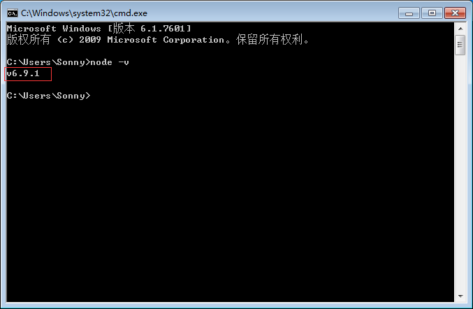
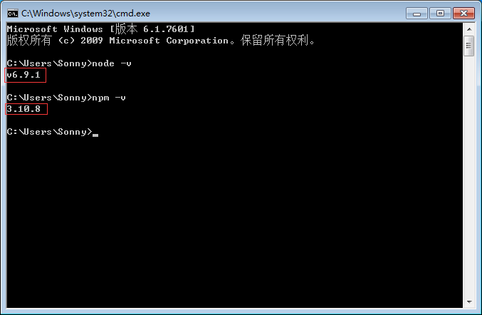
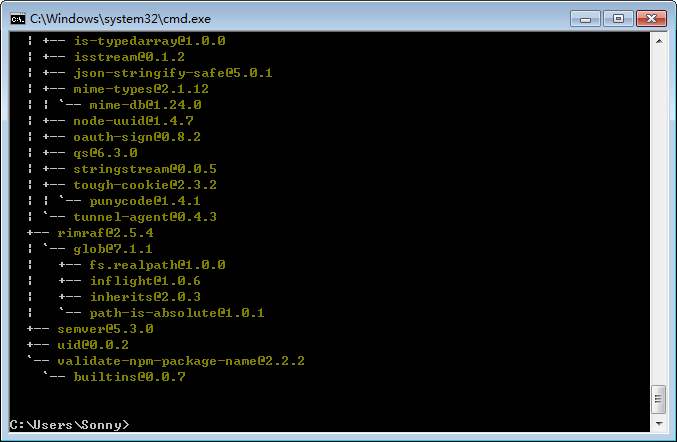
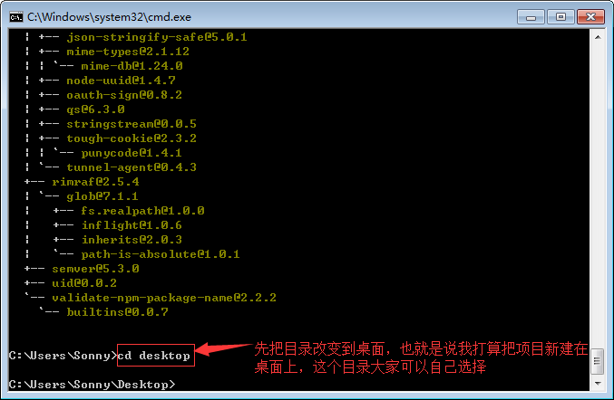
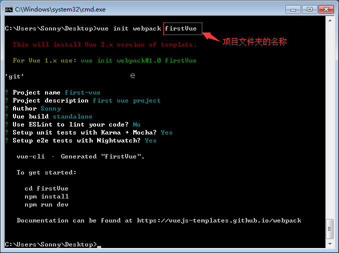
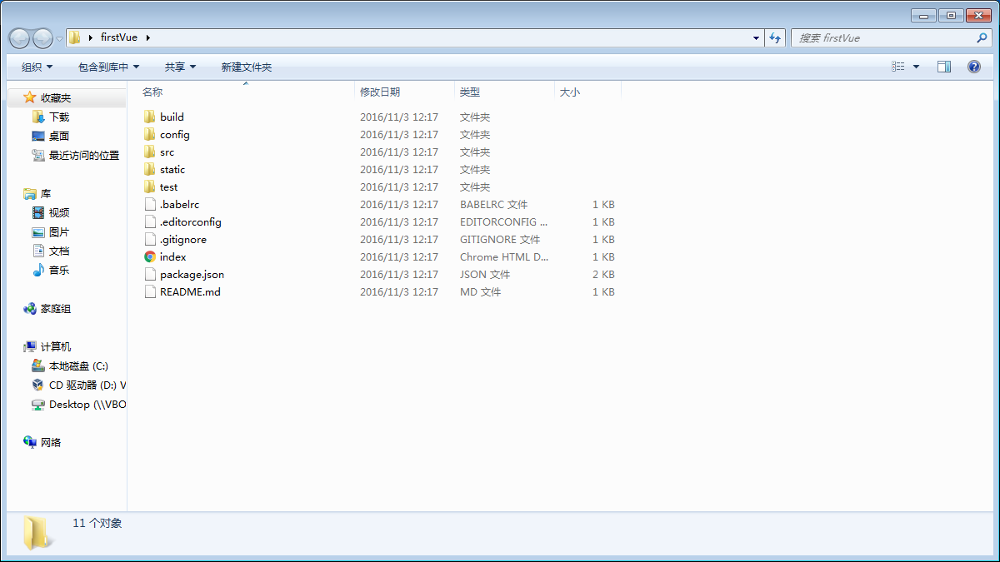
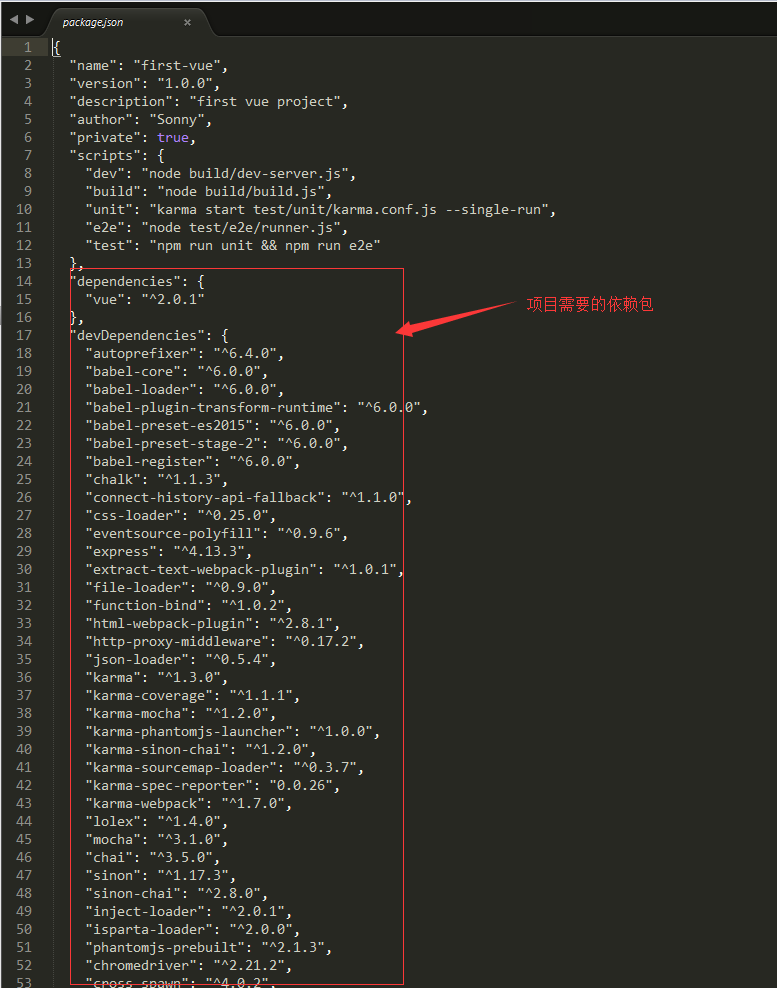
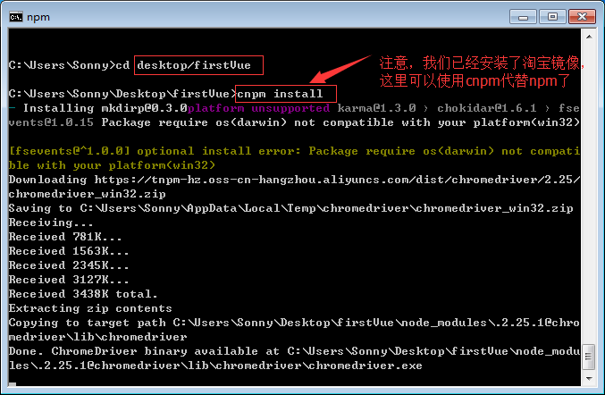
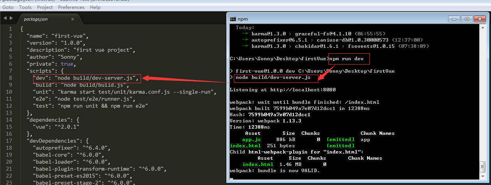

Vue.js （读音 /vjuː/，类似于 view） 是一套构建用户界面的渐进式框架。与其他重量级框架不同的是，Vue 采用自底向上增量开发的设计。Vue的核心库只关注视图层，它不仅易于上手，还便于与第三方库或既有项目整合。另一方面，当与单文件组件和Vue生态系统支持的库结合使用时，Vue 也完全能够为复杂的单页应用程序提供驱动。这里是说的是最新的2.0版本。

#### 安装node.js

从node.js官网下载并安装node，安装过程很简单，一路“下一步”就可以了（傻瓜式安装）。
安装完成之后，打开命令行工具，输入 node -v，如下图，如果出现相应的版本号，则说明安装成功。

npm包管理器，是集成在node中的，所以，直接输入 npm -v就会如下图所示，显示出npm的版本信息。

OK！node环境已经安装完成，npm包管理器也有了。由于有些npm有些资源被屏蔽或者是国外资源的原因，经常会导致用npm安装依赖包的时候失败，所有我还需要npm的国内镜像---cnpm。

#### 安装cnpm

在命令行中输入以下，然后等待，安装完成如下图。

	$ npm install -g cnpm --registry=https://registry.npm.taobao.org

完成之后，我们就可以用cnpm代替npm来安装依赖包了。如果想进一步了解cnpm的，查看[https://npm.taobao.org/](淘宝npm镜像官网)。

#### 安装vue-cli脚手架构建工具

在命令行中运行命令 npm install -g vue-cli ，然后等待安装完成。
通过以上三部，我们需要准备的环境和工具都准备好了，接下来就开始使用vue-cli来构建项目。

#### 用vue-cli构建项目

要创建项目，首先我们要选定目录，然后再命令行中把目录转到选定的目录。在这里，我选择桌面来存放新建的项目，则我们需要先把目录cd到桌面，如下图。

在桌面目录下，在命令行中运行命令 vue init webpack firstVue 。解释一下这个命令，这个命令的意思是初始化一个项目，其中webpack是构建工具，也就是整个项目是基于webpack的。其中firstVue是整个项目文件夹的名称，这个文件夹会自动生成在你指定的目录中（我的实例中，会在桌面生成该文件夹），如下图。

运行初始化命令的时候回让用户输入几个基本的选项，如项目名称，描述，作者等信息，如果不想填直接回车默认就好。

打开firstVue文件夹，项目文件如下所示。

这就是整个项目的目录结构，其中，我们主要在src目录中做修改。这个项目现在还只是一个结构框架，整个项目需要的依赖资源都还没有安装，如下图。

#### 安装项目所需的依赖

要安装依赖包，首先cd到项目文件夹（firstVue文件夹），然后运行命令 cnpm install ，等待安装。

安装完成之后，会在我们的项目目录firstVue文件夹中多出一个node_modules文件夹，这里边就是我们项目需要的依赖包资源。

安装完依赖包之后，就可以运行整个项目了。

#### 运行项目

在项目目录中，运行命令 npm run dev ，会用热加载的方式运行我们的应用，热加载可以让我们在修改完代码后不用手动刷新浏览器就能实时看到修改后的效果。

这里简单介绍下 npm run dev 命令，其中的“run”对应的是package.json文件中，scripts字段中的dev，也就是 node build/dev-server.js命令的一个快捷方式。

项目运行成功后，浏览器会自动打开localhost:8080（如果浏览器没有自动打开，可以手动输入）。运行成功后，会看到如下所示的界面。

如果看到这个页面，那就可以开屏香槟来庆祝了，恭喜你，项目运行成功了。

转[http://www.cnblogs.com/libin-1/p/6196106.html](http://www.cnblogs.com/libin-1/p/6196106.html)
